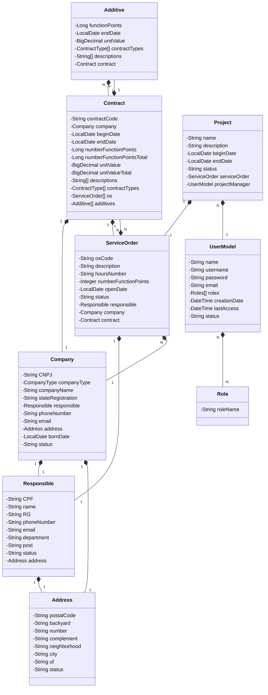

# OSWorks : Java RESTful API ☕

Este é um projeto que visa fornecer a criação de uma API de gerenciamento de contrato, ordem de serviços (OS), projetos,cliente 
e fornecedor juntamente com a emissão de OS com base no contrato de serviço criado. 
O projeto inclui uma API em Java com Spring.

     
    
    

---

## Sprints Do Projeto
O Projeto foi desenvolvido durante a matéria de Laboratório De Software organizada pelo Dr. Rodrigo Lisboa. Separados em grupo
cada grupo desenvolveu uma aplicação Web usando linguagem e framework de sua escolha, sendo o processo de desenvolvimento
a junção do RUP (*Rational Unified Process*) juntamente com a metodologia ágil *scrum*, no qual o desenvolvimento do produto é divido em
*sprints* sendo uma semana para execução de cada *sprint*

   - 1ª Sprint: Criação Das Entidades, Empresa, Endereço, Contrato e Ordem de Serviço juntamente com CRUD Inicial
   - 2ª Sprint: Criação Das Entidades, Projeto, Responsável, Autoridade e Usuário juntamente com CRUD Inicial
   - 3ª Sprint: Criação Das Regras Principais De Negócio e Ciclo de vida do Contrato, Ordem De Serviço e Projeto
   - 4ª Sprint: Criação Dos *Handles* da API, Adição De Segurança da aplicação e Adição da Documentação no *Swagger*

--- 

## Diagrama de Classes (Domínio da API)

--- 

## Configuração

Essas instruções fornecerão aos usuários as etapas necessárias para clonar o repositório e iniciar a aplicação em
diferentes ambientes (Unix e Windows).

1. Clone o repositório: `git clone git@github.com:samuelfilho-dev/osworks-api.git`
2. Instale o Container Postgres `docker run -p 5432:5432 --env POSTGRES_USER=root --env POSTGRES_PASSWORD=root --env POSTGRES_DB=os_works --pull missing postgres:latest`
3. Configure as Varivaveis de Ambiente em `application.yml`
4. Compile sua aplicação usando Maven: `mvn clean install`
5. Execulte a Aplicação Usando Java v17: `java -jar target/osworks-0.0.1-SNAPSHOT.jar`

> Caso Tenha dúvida de como instalar:
>  - [Docker](https://docs.docker.com/get-docker/)
>  - [Java v17](https://www.youtube.com/watch?v=QekeJBShCy4)
>  - [Maven](https://www.youtube.com/watch?v=edF1G8RYDTU)
--- 

## Documentação do Swagger

A documentação da API pode ser encontrada no Swagger. Para visualizá-la,
acesse: [Documentação do Swagger](http://localhost:8080/swagger-ui/index.html#/).

---

## Licença

Este projeto está licenciado sob a licença MIT. Consulte o
arquivo [(LICENSE)](https://github.com/samuelfilho-dev/osworks-api/blob/master/LICENSE) para obter.

--- 
## Autores

| [ Samuel Filho](https://github.com/samuelfilho-dev) | [ Paulo Sergio](https://github.com/ArautD) | [ Fransualdo Lopes	](https://github.com/Fransualdo-Lopes) |
|:---------------------------------------------------------------------------------------------------------------------------------------:|:-------------------------------------------------------------------------------------------------------------------------------:|:---------------------------------------------------------------------------------------------------------------------------------------------:|
|                                        [Linkedin](https://www.linkedin.com/in/samuelfilho-dev/)                                         |                              [Linkedin](https://www.linkedin.com/in/paulo-sergio-lemos-29741b125/)                              |                                      [Linkedin](https://www.linkedin.com/in/fransualdo-lopes-27ab2165/)                                       |
|                                                           Back-end Developer                                                            |                                                       Back-end Developer                                                        |                                                                    DevOps                                                                     |

